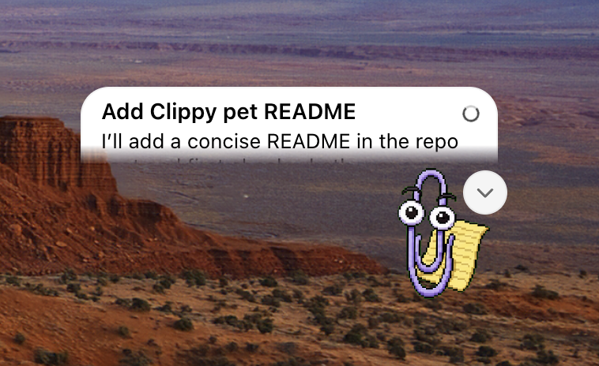

# Clippy Codex Pet

This repo contains the sprites and everything needed for Clippy, the famous assistant from Windows back in the '90s, using the new Codex pets ability.

## Preview



## Instructions

Clone this repo, then copy the `Clippy` folder into the `pets` folder inside your own `.codex` directory.

For example, on my machine that path is:

```text
/Users/diegocabezas2/.codex/pets/Clippy
```
